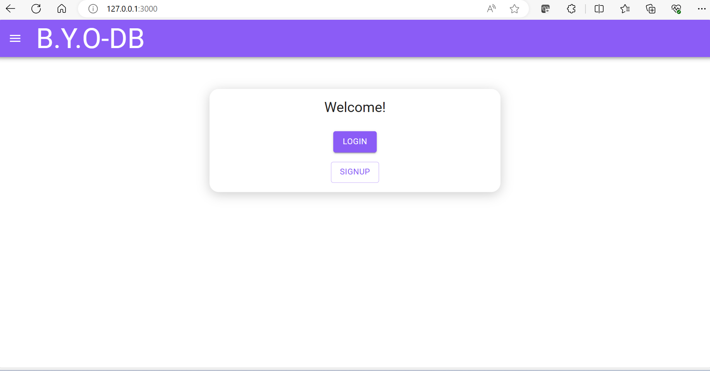
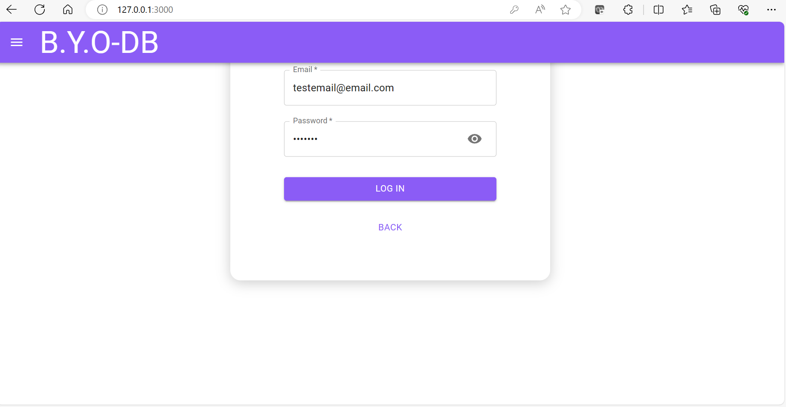
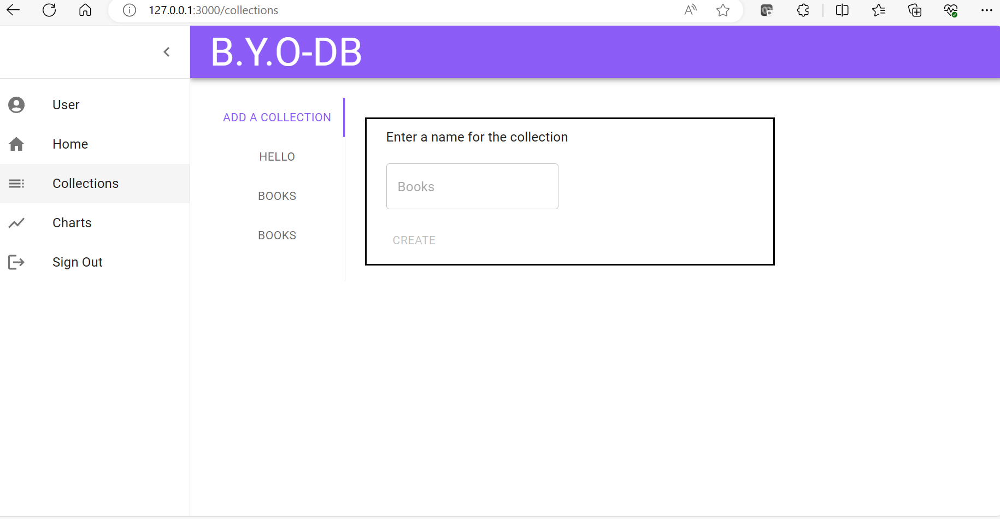
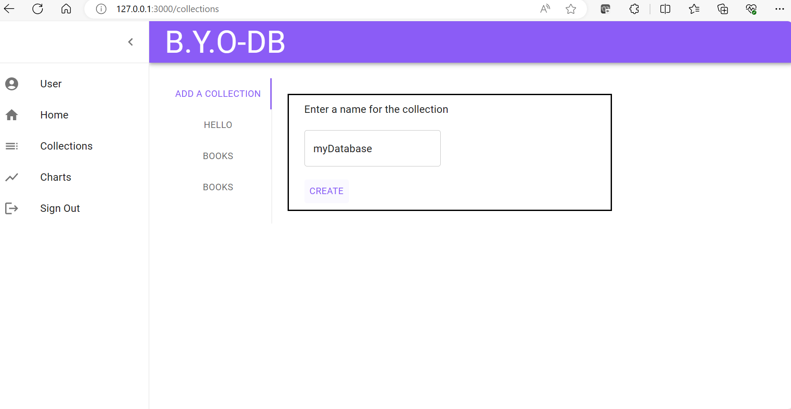
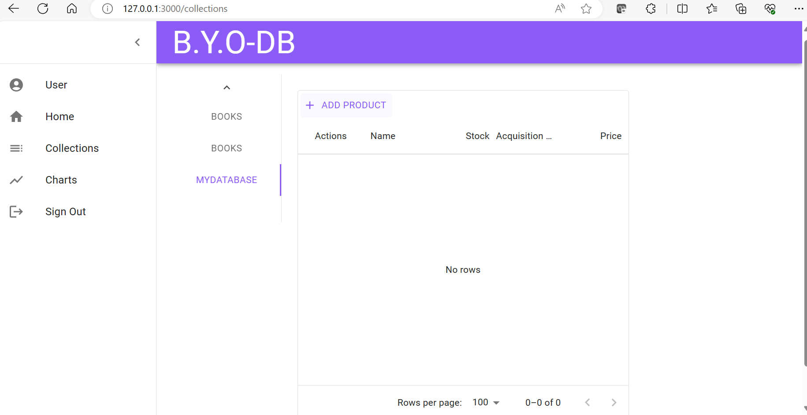
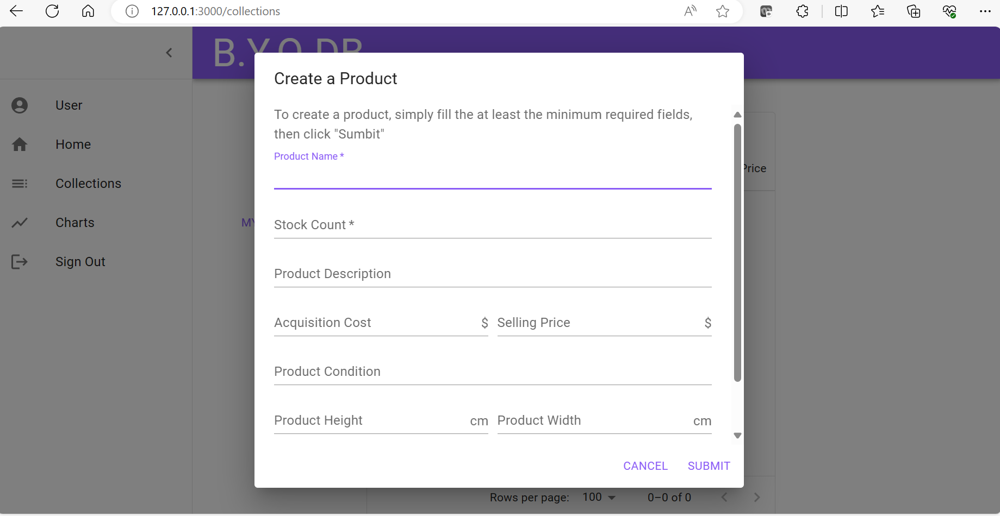

# BYO-DB

## Description

Build Your Own-DB (BYO-DB) is a DBMS (DataBase Management System) that serves as an interface between the end-user and the Database. 

The motivation behind the BYO-DB was to give users with a non-technical background the ability to create and manage their own databases in a user-friendly and interactive way. This project gives the end user all the tools necessary 
to store, organize, access, query, and manipulate the data within a Database. Furthermore, BYO-DB, also displays a visual represantion of the data within their database to further facilitate the decision making capabilities of the end-user. 

## Installation

There is no installation required on the users' end. All you need to do to start using the BYO-DB Application is click the following URL link that will take you to the application: https://flex-db.onrender.com/

## Usage

Using the BYO-DB application is very easy as it was built with interactivity and the end-user in mind. First, you will need to sign up and create and account. Then, you will login once your account has been created. Once you are logged in, you will have access to the Collections and Graphs tabs within the hamburger menu. In the Collections tab, you will have access to all the functionality needed to crete and manage your Database. You are able to create, organize, access, query, and update any of the data in the database. 

## Credits

Kevin Rodriguez on Github: https://github.com/kev-rod43/
Hunter Bell on Github: https://github.com/HunterBell512
Alejandro Rodriguez on Github: https://github.com/Summerof1993
Jeffrey Scott on Github: https://github.com/vader9911

## License

MIT License.

---